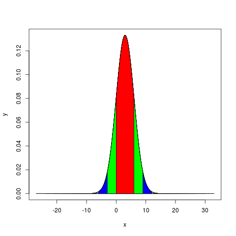

## Rendered



## Execute

```bash
$ R
> source("Gaussian-k-sigma.r")
[1] "k= 10 , P(...)= 1"
[1] "k= 9 , P(...)= 1"
[1] "k= 8 , P(...)= 0.999999999999999"
[1] "k= 7 , P(...)= 0.99999999999744"
[1] "k= 6 , P(...)= 0.999999998026825"
[1] "k= 5 , P(...)= 0.999999426696856"
[1] "k= 4 , P(...)= 0.999936657516334"
[1] "k= 3 , P(...)= 0.99730020393674"
[1] "k= 2 , P(...)= 0.954499736103642"
[1] "k= 1 , P(...)= 0.682689492137086"
Warning message:
In plot.xy(xy, type, ...) :
  plot type 'lines' will be truncated to first character
>
```